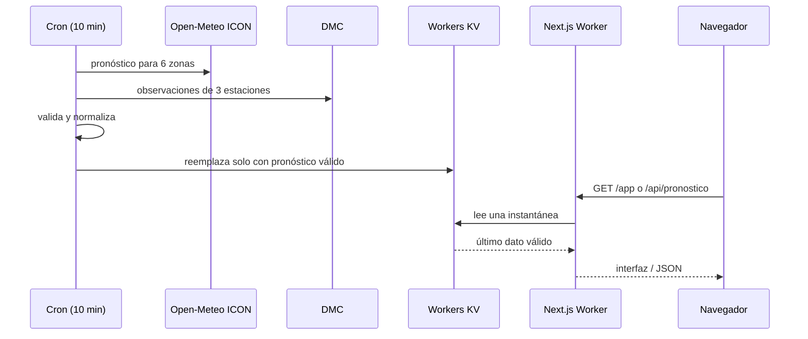

# Arquitectura y decisiones de Encumbra

Este documento es la fuente técnica y de producto vigente. Consolida el
contrato funcional, el sistema visual y las decisiones históricas que todavía
explican el código. El comportamiento ejecutable vive en el código y sus
pruebas; si ambos discrepan, la diferencia debe investigarse antes de editar.

Última revisión: 22 de septiembre de 2026.

## 1. Contrato de producto

Encumbra responde tres preguntas para personas que elevan volantines en
Santiago: **si conviene salir, cuándo y dónde**. No presupone conocimientos
meteorológicos y prioriza una decisión legible sobre una tabla de datos.

Principios:

1. Un pronóstico no es una medición en terreno.
2. Dos parques dentro de la misma celda no reciben diferencias inventadas.
3. El viento no confirma acceso, iluminación ni seguridad de un recinto.
4. La ausencia de evidencia pública no se convierte en una prohibición.
5. La falta de datos se muestra como tal; nunca se rellena por intuición.
6. La noche y el estado del viento se comunican como condiciones distintas.
7. El score interno no llega a la interfaz.

Las superficies tienen responsabilidades separadas:

| Ruta | Responsabilidad |
| --- | --- |
| `/` | Explicar el valor y conducir a la aplicación |
| `/app` | Explorar parques, planificar una salida y prepararse |
| `/volar` | Consultar rápidamente el pronóstico y la dirección en terreno |
| `/guia` | Agrupar contenido estable que explica viento, lugares y seguridad |
| `/guia/*` | Responder una intención de búsqueda con evidencia y fuentes visibles |
| `/api/pronostico` | Entregar la última instantánea validada |
| `/api/ubicacion` | Resolver una consulta puntual y efímera de GPS |
| `/api/calendario` | Exportar una ventana validada en formato iCalendar |

## 2. Modelo meteorológico

### Bandas y perfiles

`lib/bandas.ts` es la única fuente de umbrales. El score combina una campana
gaussiana por perfil con una penalización absoluta de racha:

| Perfil | Centro | Sigma | Techo de racha |
| --- | ---: | ---: | ---: |
| Liviano | 12 km/h | 5 | 22 km/h |
| Tradicional | 14 km/h | 5,5 | 28 km/h |
| Acrobático | 20 km/h | 7 | 38 km/h |

Viento o racha desde 45 km/h activa el corte de peligro. Un score desde 65 es
ideal y desde 40 es marginal. La UI traduce el resultado a `plancha`, `liviano`,
`ideal`, `bravo` o `peligro`, siempre con texto además de color.

La calibración reproducible está en `calibracion/calibrar.py`. Se apoya en
ERA5 2021–2025 para Parque O'Higgins y rangos de vuelo publicados por la
American Kitefliers Association. Es evidencia para una primera clasificación,
no una validación física definitiva de cada tipo de volantín chileno.

### Fuentes y responsabilidades

| Fuente | Uso | Lo que no se afirma |
| --- | --- | --- |
| Open-Meteo ICON | Seis zonas periódicas de Santiago | Diferencias dentro de una celda |
| Open-Meteo Best Match | Pronóstico principal del GPS solicitado | Medición exacta en la coordenada |
| ICON + ECMWF | Contraste horario del pronóstico puntual | Promedio o verdad por consenso |
| DMC | Observación reciente de una estación cercana | Viento dentro del parque o pronóstico |
| ERA5 | Calibración histórica reproducible | Estado actual del tiempo |

Best Match entrega la lectura puntual principal. ICON y ECMWF se comparan para
el perfil elegido: si cambian la decisión, la UI informa **Pronóstico
incierto**. No se promedian magnitudes de modelos distintos. DMC permanece como
una observación separada con estación, distancia y antigüedad.

## 3. Flujo de datos



`custom-worker.ts` extiende el handler generado por OpenNext con `scheduled`.
El cron corre cada diez minutos y guarda `pronostico:santiago:v1`. Si falla
ICON, no pisa el último éxito. Si una estación DMC falla, conserva las demás y
la UI oculta automáticamente observaciones antiguas.

Una vez por hora se registra durante 35 días una muestra por estación con la
observación DMC y los pronósticos emitidos por ICON y ECMWF. Esta serie no
contiene coordenadas de usuarios y existe para medir sesgo y error antes de
ponderar cualquier modelo.

### Ubicación puntual

La ubicación sigue otro flujo porque depende de una acción actual:

1. El navegador solicita GPS con `enableHighAccuracy`.
2. Conserva la precisión completa solo en memoria para distancias locales.
3. Envía al servidor latitud y longitud reducidas a tres decimales.
4. El Worker valida que estén dentro del alcance de Santiago y aplica 30
   consultas por minuto por identidad de red.
5. Open-Meteo Best Match, ICON y ECMWF se consultan con un timeout de 10 s.
6. Nominatim resuelve el nombre con un timeout de 5 s; su fallo no elimina el
   pronóstico.
7. La respuesta no se cachea y las coordenadas no se escriben en KV ni
   `localStorage`.

La comuna es una etiqueta territorial. La distancia al centro efectivo del
modelo se muestra porque una celda meteorológica no es una medición hiperlocal.

## 4. Frontend y sistema visual

Next.js App Router usa Server Components por defecto. Las dos fronteras cliente
principales son `EncumbraApp` y `Vivo`; sus componentes interactivos heredan la
frontera. El mapa se importa dinámicamente tras una acción explícita para no
sumar MapLibre al primer render.

La navegación de `/app` prioriza Parques, Mi salida y Prepararme. Es inferior
en móvil y lateral desde escritorio. La lista conserva toda la funcionalidad
si el mapa falla. `/volar` reduce la interfaz a decisión, mediciones, luz y guía
de orientación.

### Identidad

La dirección visual es **Sol de septiembre + atmósfera mate**:

- Archivo variable como familia única;
- hueso y carbón como superficies de lectura;
- amarillo solar para acciones y coral/dorado como acentos;
- colores semánticos independientes para los estados meteorológicos;
- textura local de papel, sin glassmorphism ni recursos decorativos genéricos;
- volantín de papel y wordmark propios, compartidos entre superficies.

Los tokens viven en `public/design-tokens.css`; `app/globals.css` implementa
composición y responsive. El tema oscuro usa carbón cálido y no altera el
significado de las bandas. La elección se guarda localmente; `/volar` no muestra
el control para proteger el espacio de consulta.

### Accesibilidad y responsive

- HTML semántico, enlace para saltar al contenido y landmarks identificados.
- Foco visible, controles táctiles amplios y estado sin depender solo de color.
- Nombres accesibles para controles, mapa y SVG relevantes.
- `prefers-reduced-motion` desactiva transiciones no esenciales.
- Navegación y contenido probados desde 320 px hasta escritorio.
- La brújula se solicita por interacción, descarta lecturas relativas y
  mantiene un fallback con norte arriba.

## 5. Parques, evidencia y seguridad física

El modelo separa tipo de lugar, precisión, permiso, evidencia y riesgo vial.
Las recomendaciones iniciales incluyen solo recintos con autorización
respaldada; la búsqueda y el mapa permiten consultar el catálogo completo con
su estado visible. `Permiso no confirmado` no significa `prohibido`.

La Bandera conserva una advertencia vial oficial con fuente y fecha. Las reglas
de seguridad permanentes incluyen no usar hilo curado, mantenerse lejos de
cables y vías, no perseguir un volantín cortado cruzando una calle y confirmar
reglas y horarios del lugar. Una checklist ayuda a prepararse, pero no certifica
una salida segura.

## 6. Seguridad y privacidad

La revisión se organiza con el OWASP Top 10 como lista de amenazas, no como una
certificación:

| Riesgo | Control aplicado |
| --- | --- |
| Control de acceso | No hay cuentas ni operaciones privadas; APIs validadas y de solo lectura |
| Configuración insegura | CSP con nonce, HSTS, `nosniff`, `DENY`, Referrer y Permissions Policy |
| Cadena de suministro | Lockfile, Dependabot, audit de producción en CI y overrides documentados |
| Inyección | Sin SQL ni HTML de usuarios; JSON-LD serializado escapando cierres de script |
| SSRF / abuso saliente | Proveedores y rutas fijos, coordenadas acotadas, timeouts y rate limit |
| Exposición de secretos | DMC solo en secretos del Worker; errores saneados y sin query strings |
| Integridad de datos | Esquemas manuales, unidades esperadas y último éxito inmutable ante fallos |
| Registro y monitoreo | Observabilidad de Cloudflare sin registrar GPS, tokens o respuestas crudas |

La CSP permite estilos inline porque MapLibre calcula posicionamiento en
atributos `style`, y permite `blob:` para su Worker. Scripts propios reciben un
nonce por request y `object-src`/`frame-src` permanecen bloqueados. El rate
limiter falla abierto si el binding no responde para no convertir una
dependencia auxiliar en caída total, mientras registra solo un mensaje genérico.

No se almacenan cuentas, nombres, correos ni coordenadas personales. Favoritos,
tema y último pronóstico pueden quedar en el dispositivo. DMC nunca llega con
sus credenciales al cliente.

## 7. SEO, GEO, metadatos y PWA

- títulos y descripciones por ruta;
- canonical absoluto, Open Graph y Twitter Card;
- imagen social generada por Next;
- `robots.txt` y `sitemap.xml` tipados, con `lastmod` solo cuando es real;
- JSON-LD `WebSite`, `WebApplication`, `Article` y `BreadcrumbList`, sin
  valoraciones ni entidades ficticias;
- tres guías con texto servido en HTML, autoría, revisión, fuentes primarias y
  enlaces internos desde la portada;
- ubicación expresada en el contenido y los datos, sin fingir que Encumbra es
  un negocio local ni añadir páginas débiles por cada comuna;
- verificación pública y comando manual de IndexNow para Bing y participantes;
- manifest instalable, iconos `any` y `maskable`, shortcuts y service worker.

Las APIs quedan fuera del sitemap y se bloquean en robots. `/volar` usa
`noindex, follow` y tampoco entra al sitemap porque depende del contexto elegido
en la aplicación. Eso reduce indexación accidental, pero no se trata como un
mecanismo de autorización.

GEO se entiende como visibilidad en respuestas generativas, no como una capa de
marcado separada. La guía vigente de Google no pide `llms.txt`, archivos de IA
ni schema especial: exige que las páginas sean indexables, enlazables, útiles y
coherentes entre texto y datos estructurados. Encumbra prioriza información
propia y citable —bandas, metodología y catálogo con vigencia— sobre contenido
escalado. Search Console y Bing Webmaster Tools siguen siendo necesarios para
medir consultas reales y decidir futuras páginas, no se infieren volúmenes.

## 8. Operación y verificación

Variables secretas:

- `DMC_USUARIO`
- `DMC_TOKEN`

Bindings declarados:

- `PRONOSTICO`: Workers KV;
- `LOCATION_RATE_LIMITER`: Cloudflare Rate Limiting;
- `ASSETS`: artefactos estáticos de OpenNext.

Cadena mínima antes de desplegar:

```bash
pnpm install --frozen-lockfile
pnpm check
pnpm audit --prod --audit-level high
pnpm exec opennextjs-cloudflare build
ENCUMBRA_BASE=http://localhost:3000 python3 scripts/smoke-firefox.py
pnpm run indexnow # después del despliegue, solo si cambiaron URLs públicas
```

El smoke oficial se ejecuta con Firefox visible y cubre consola, overflow,
tema, parque manual, GPS simulado, mapa y orientación simulada. El despliegue
manual es `pnpm run deploy`; `pnpm deploy` invoca otro comando de pnpm.

CI aplica permisos de lectura, cancela ejecuciones obsoletas, repite la cadena
de calidad y falla ante vulnerabilidades altas conocidas. Dependabot propone
actualizaciones de npm semanalmente y de GitHub Actions mensualmente.

## 9. Decisiones que deben conservarse

- No volver a GFS sin verificar la coherencia entre viento y racha.
- No usar caché de módulo o `revalidate` como reemplazo de KV compartido.
- No cargar MapLibre en el primer render.
- No añadir `runtime = "edge"`; OpenNext empaqueta el destino Worker.
- No presentar orientación relativa del teléfono como una brújula.
- No convertir una observación DMC en corrección del pronóstico sin medir sesgo.
- No publicar lugares comunitarios como autorizados ni inventar coordenadas.
- No duplicar umbrales fuera de `lib/bandas.ts`.

## 10. Deuda explícita

- Validar bandas con salidas reales repetidas y con observaciones DMC alineadas.
- Probar brújula y permisos en iPhone y Android físicos al aire libre.
- Medir el costo real del primer JavaScript por ruta y seguir reduciéndolo sin
  retirar información de seguridad.
- Verificar el dominio en Google Search Console y Bing Webmaster Tools, enviar
  el sitemap y revisar consultas antes de ampliar el contenido editorial.
- Confirmar periódicamente vigencia, horarios y autorización de los parques.
- Revisar condiciones de los proveedores antes de cualquier uso comercial.
- Dividir los componentes cliente principales cuando una frontera nueva reduzca
  complejidad o transferencia medible; no hacerlo solo por contar líneas.

## 11. Regla para cambios futuros

Antes de cambiar datos, dominio o UX: comprobar la fuente; escribir el caso que
falla; modificar la única fuente correspondiente; ejecutar pruebas, lint, build
y smoke; medir el impacto; y documentar únicamente la decisión durable. Los
logs cronológicos, identificadores de despliegue y prompts no vuelven a ser una
segunda fuente de verdad: Git y Cloudflare ya conservan esa historia.
